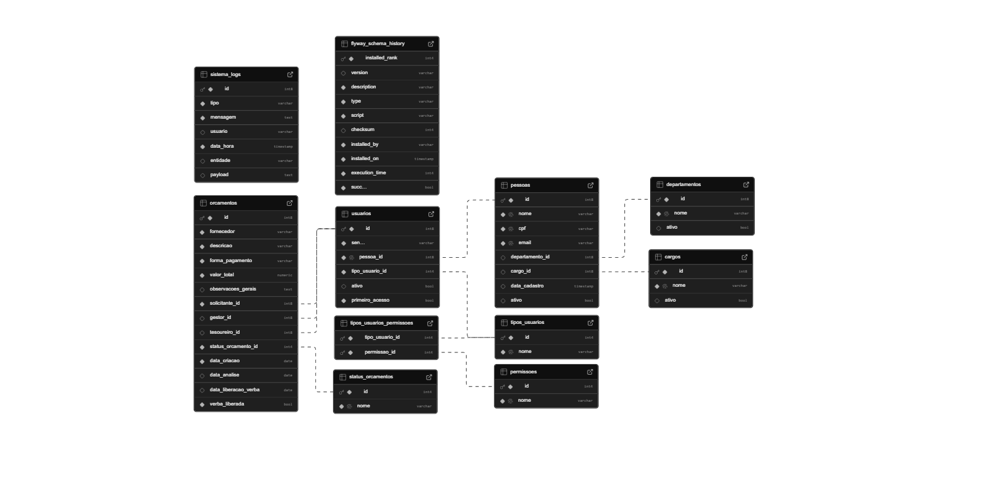

<h1 align="center"> Controle Verbas — API REST <br>
  
</h1>

---

<h2 align="center"> Visão Geral do Projeto</h2>

**Controle Verbas** é uma **API REST** completa, segura e totalmente automatizada que integra seu [frontend](https://github.com/renancvitor/controle-verbas-frontend), com autenticação via [JWT](https://jwt.io/), validação robusta e arquitetura profissional com [Spring Boot](https://spring.io/projects/spring-boot).<br>
Desenvolvido principalmente para prática de backend, o projeto também pode atender pequenas empresas que buscam organizar seu fluxo de verbas.<br>
O projeto adota arquitetura em camadas (controller, service, repository, domain e DTOs), aplicando boas práticas de organização, responsabilidade e manutenção de código.

O desenvolvimento do projeto consolidou habilidades como:
- 🏗️ Arquitetura RESTful
- 🧪 Testes unitários e de integração com [JUnit 5](https://junit.org/) e 🔧 [Mockito](https://site.mockito.org/)
- ✅ Validações robustas com Bean Validation
- 🛠️ Tratamento de erros
- 📖 Documentação automatizada com [Swagger (OpenAPI)](https://swagger.io/specification/)
- 🔒 Segurança com [JWT (JSON Web Token)](https://jwt.io/)

A arquitetura em camadas e as boas práticas aplicadas tornam o código organizado, escalável e fácil de manter.

---

<h2 align="center"> Tecnologias Utilizadas</h2>

- ☕ [Java 17](https://www.java.com/pt-BR/) ou superior + 🌱 [Spring Boot 3](https://start.spring.io/)
- 🔒 [Spring Security](https://spring.io/projects/spring-security) + 🔑 [JWT](https://jwt.io/)
- 📦 [JPA](https://spring.io/projects/spring-data-jpa) + 🛠️ [Hibernate](https://hibernate.org/)
- 🐘 Banco de dados [PostgreSQL](https://www.postgresql.org/)
- 🛠️ Controle de versionamento de banco com [Flyway](https://flywaydb.org/)
- 📦 [Maven](https://maven.apache.org/): Gerenciamento de dependências e build.
- 🧪 [JUnit 5](https://junit.org/)
- 🔧 [Mockito](https://site.mockito.org/)
- 📄 [Swagger (OpenAPI)](https://swagger.io/specification/)
- 🐧 [WSL](https://ubuntu.com/desktop/wsl) e 🐳 [Docker CLI](https://www.docker.com/products/cli/)

---

<h2 align="center"> Ferramentas Utilizadas</h2>

- 💻 [Visual Studio Code](https://code.visualstudio.com/): Ambiente de desenvolvimento integrado (IDE) leve e extensível.
- 🐘 [PostgreSQL](https://www.postgresql.org/): Sistema de gerenciamento de banco de dados relacional de código aberto, usado via CLI em contêiner Docker.
- 📡 [Insomnia](https://insomnia.rest/): Ferramenta de teste de APIs REST que permite enviar requisições HTTP, validar respostas e testar endpoints com facilidade. 

---

<h2 align="center"> Migrations e Versionamento de Banco</h2>

O projeto utiliza o [Flyway](https://flywaydb.org/) para gerenciar as **migrations de banco de dados** no [PostgreSQL](https://www.postgresql.org/). Todas as alterações de estrutura no banco, como criação de tabelas e mudanças de schema, são versionadas e controladas. Isso garante consistência entre os ambientes de desenvolvimento e produção.

---

<h2 align="center"> Funcionalidades</h2>

O **Controle Verbas** é um backend desenvolvido com [Spring Boot](https://spring.io/projects/spring-boot), com foco em boas práticas e organização de **API REST**.

### 🔒 Autenticação e Segurança
- Cadastro e login de usuários
- Autenticação via [JWT](https://jwt.io/)
- Controle de acesso baseado em perfis de usuário

### 📚 **Gerenciamento de Conteúdo**
- **Cargos e Departamentos**
  - Cadastrar
  - Listar (com paginação e filtros)
  - Editar
  - Soft delete
  - Ativar
- **Permissões**
  - Organização dos tipos de usuários
- **Status**
  - Organização dos status dos orçamentos
- **Pessoas e Usuários**
  - Cadastrar
  - Listar (com paginação e filtros)
  - Editar dados básicos
  - Editar permissões
  - Editar senha
  - Soft delete
  - Ativar
- **Orçamentos**
  - Cadastrar
  - Listar orçamentos (com paginação e filtros)
  - Aprovar/Reprovar
  - Controlar status
  - Marcar um orçamento como liberado

### 🛠️ **Validações e Tratamento de Erros**
- Validação de dados de entrada (DTOs com Bean Validation)
- Mensagens de erro claras e padronizadas
- Tratamento centralizado de exceções

### 📊 **Documentação**
- API documentada com [Swagger UI](https://swagger.io/specification/)

---

<h2 align="center"> Documentação Visual</h2>

### 🌐 **API - Swagger**

Para ver a interface [Swagger](https://swagger.io/specification/) em ação, acesse as [demonstrações visuais](./docs/documentacao-swagger.md) com GIFs interativos mostrando os principais endpoints da API.

### 🗂️ **Diagrama ER do banco de dados PostgreSQL**

<p align="center">
  
</p>

---

<h2 align="center"> Testes Automatizados</h2>

O projeto conta com uma **cobertura significativa de testes unitários e de integração**, garantindo a qualidade e o correto funcionamento dos fluxos principais de negócio da API, incluindo:
- Cadastro, listagem, ativar/soft delete e edição de cargos, departamentos, pessoas, usuários, orçamentos.
- Autenticação com [JWT](https://jwt.io/).
- Validações de regras de negócio.
- Tratamento global de exceções.

**Tecnologias utilizadas nos testes**
- 🧪 [JUnit 5](https://junit.org/junit5/)
- 🔧 [Mockito](https://site.mockito.org/)
- 🧪 [Spring Boot Test](https://docs.spring.io/spring-security/reference/servlet/test/index.html)

---

<h2 align="center"> Organização do Projeto</h2>

Abaixo está um resumo da estrutura de pastas e arquivos principais do projeto:

```plaintext
docs
 ├── gifs/
 ├── documentacao-swagger.md
 └── estrutura-projeto.md

src/main
 ├── java/com/api/controleverbasbackend
 │    ├── controller/
 │    ├── domain
 │    │    ├── entity/
 │    │    └── enums/
 │    ├── dto/
 │    ├── exception/
 │    ├── infra
 │    │    ├── config/
 │    │    ├── documentation/
 │    │    ├── logging/
 │    │    ├── messaging/
 │    │    └── security/
 │    ├── repository/
 │    ├── service/
 │    └── ControleVerbasBackendApplication.java
 ├── resources
 │    ├── db/
 │    └── *.properties
 ├── test/java/com/api/controleverbasbackend
 │    ├── controller
 │    │    ├── negativo/
 │    │    └── positivo/
 │    ├── Kafka/
 │    ├── service
 │    │    ├── negativo/
 │    │    └── positivo/
 │    ├── utils/
 │    └── ControleVerbasBackendApplicationTests.java
 ├── LICENSE
 └── README.md
```

📌 Para a estrutura completa e detalhada, consulte [`estrutura-projeto.md`](./docs/estrutura-projeto.md).

---

<h2 align="center"> Como Executar o Projeto</h2>

### Pré-requisitos:
- ☕ [Java 17](https://www.java.com/pt-BR/) ou superior
- 🐳 [Docker](https://www.docker.com/) e [Docker Compose](https://docs.docker.com/compose/) instalados
- 💻 IDE de sua preferência ([IntelliJ IDEA](https://www.jetbrains.com/pt-br/idea/), [VSCode](https://code.visualstudio.com/), [Eclipse](https://eclipseide.org/) etc.)
- 🐧 [WSL](https://ubuntu.com/desktop/wsl) (se estiver usando Windows)

### Passo a passo:
1. Clone o repositório
```bash
git clone https://github.com/seu-usuario/controle-verbas-backend.git
```
2. Acesse a pasta do projeto
```bash
cd controle-verbas-backend
```
3. Inicie os serviços necessários no Docker (PostgreSQL e Kafka)
```bash
docker-compose up -d
```
Isso vai criar os containers do banco de dados e da mensageria. Certifique-se de que as portas configuradas no docker-compose.yml não estejam sendo usadas por outros serviços.

4. Verifique se todos os containers estão disponíveis
```bash
docker ps
```
Verifique se os containers do PostgreSQL e Kafka estão rodando.<br>
⚠️ **Se algum container não estiver ativo, volte ao passo 3.**

5. Configure o banco de dados no arquivo `src/main/resources/application-dev.properties` com suas credenciais locais. Ao iniciar o projeto, as migrations serão aplicadas automaticamente pelo [Flyway](https://flywaydb.org/).
```properties
spring.datasource.url=jdbc:postgresql://localhost:5432/nome_do_banco
spring.datasource.username=seu_usuario
spring.datasource.password=sua_senha
```
6. Execute o backend com o Maven Wrapper:
```bash
./mvnw spring-boot:run
```
7. Acesse a API pelo navegador ou ferramentas como [Insomnia](https://insomnia.rest/) na porta configurada (por padrão http://localhost:8080).<br>
⚠️ **Lembre-se de manter o Docker rodando enquanto estiver utilizando a aplicação.**
---

<h2 align="center"> Contribuições</h2>

Se você quiser contribuir para o projeto, siga estas etapas:

1. Faça um fork deste repositório.
2. Crie uma nova branch (`git checkout -b feature/alguma-coisa`).
3. Faça suas mudanças.
4. Envie um pull request explicando as mudanças realizadas.

Obrigado pelo interesse em contribuir!

---

<h2 align="center"> Contato</h2>

Se tiver dúvidas ou sugestões, sinta-se à vontade para entrar em contato:

- 📧 **E-mail**: [renan.vitor.cm@gmail.com](mailto:renan.vitor.cm@gmail.com)
- 🟦 **LinkedIn**: [Renan Vitor](https://www.linkedin.com/in/renan-vitor-developer/)

---

<h2 align="center"> Licença</h2>

📌 Este projeto está licenciado sob a [Licença MIT](LICENSE), o que significa que você pode utilizá-lo, modificar, compartilhar e distribuir livremente, desde que mantenha os devidos créditos aos autores e inclua uma cópia da licença original - veja o arquivo [LICENSE](LICENSE) para detalhes ou acesse a [licença MIT oficial](https://opensource.org/licenses/MIT).
