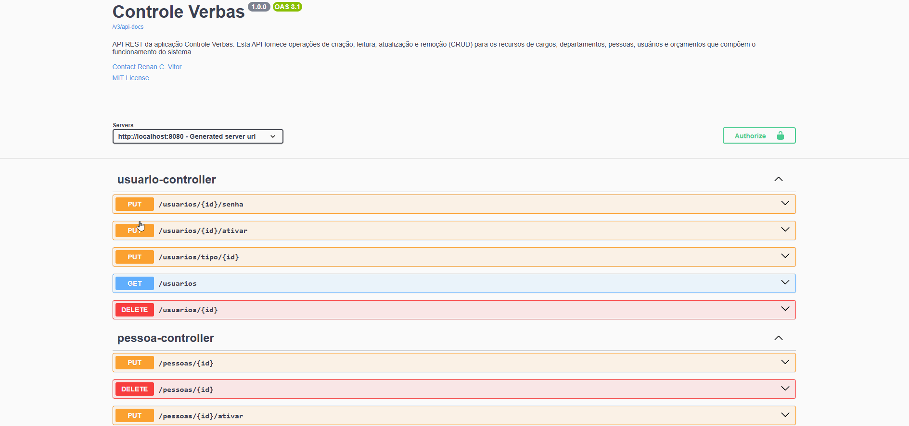
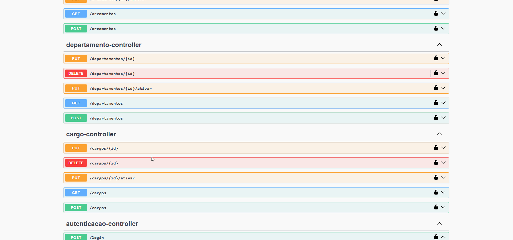
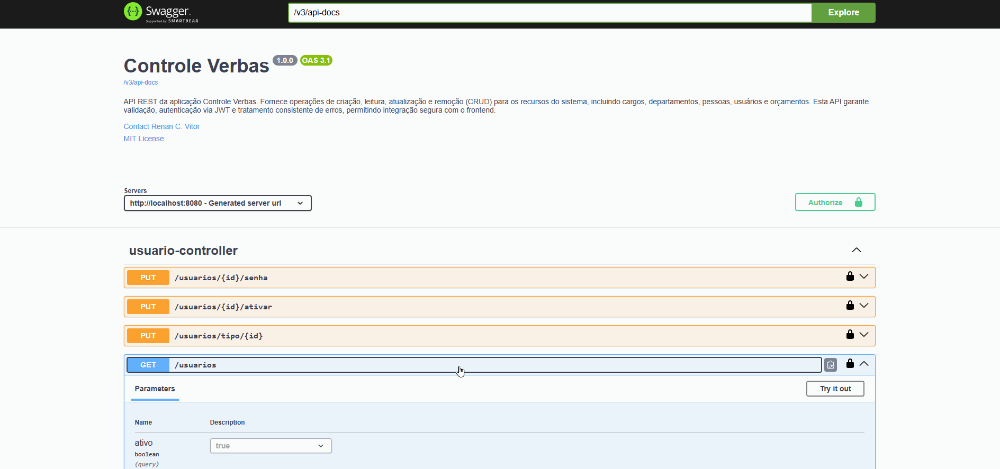
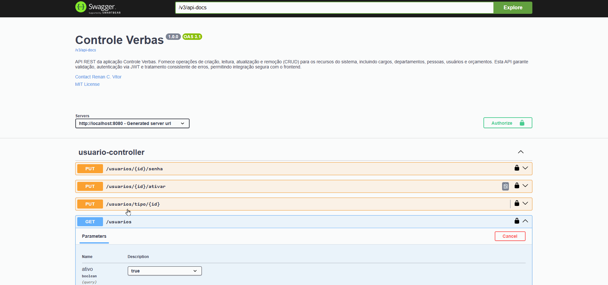
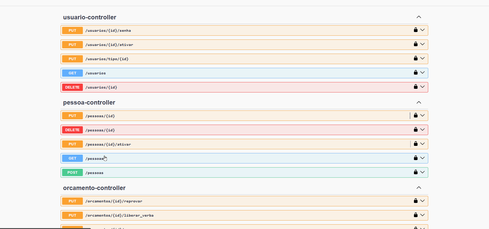
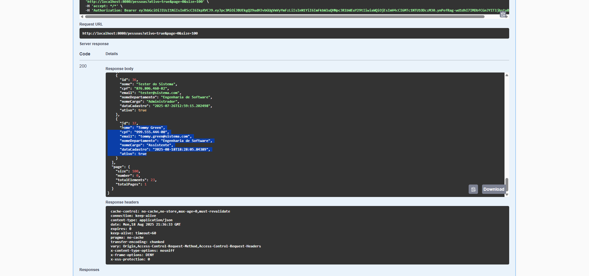
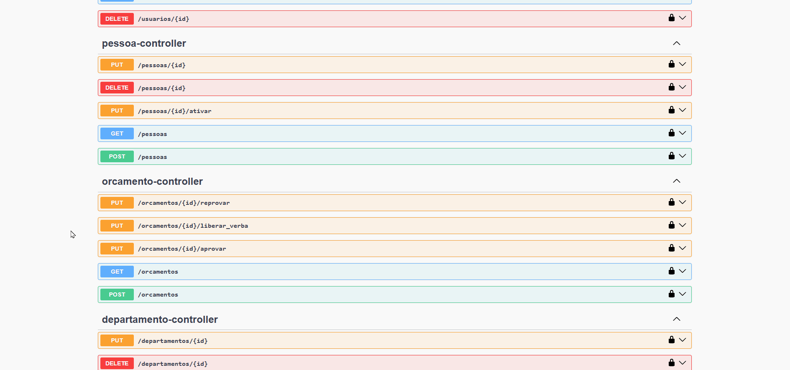
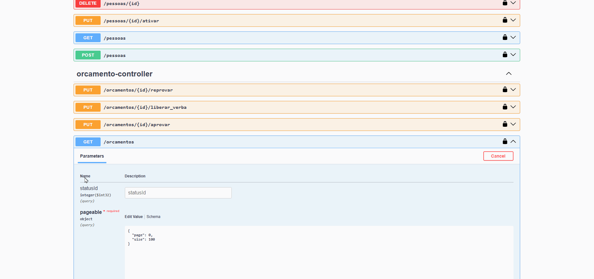
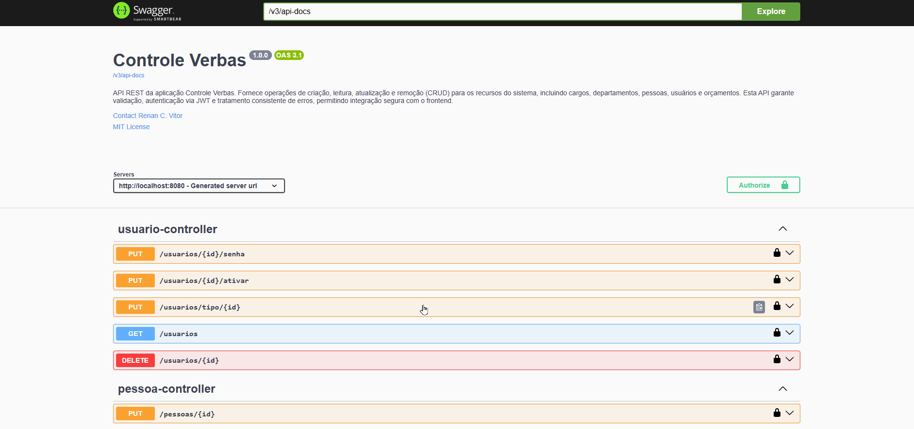

# 🎥 Swagger – Demonstrações Visuais

Este documento apresenta exemplos visuais da interface Swagger utilizada na API Controle Verbas.

---

## 🔐 Realizar login via API com JWT
Autenticação segura em ação, retornando token JWT.

---

## 📄 Listar cargos e departamentos
Resposta rápida, com paginação e filtros aplicados.

---

## 📝 Cadastrar pessoa
Exemplo de requisição POST para cadastrar uma pessoa via API REST.

---

## 📄 Listar pessoas e usuários
Resposta rápida, com paginação e filtros aplicados.

---

## ✏️ Atualizar pessoas e usuários
Exemplo de atualização parcial via endpoint PATCH.

---

## ❌✅ Remover e ativar pessoas e usuários
Soft delete e ativação de usuários, com controle de acesso aplicado.

---

## 📄 Listar orçamentos
Resposta rápida, com paginação e filtros aplicados.

---

## 📝 Cadastrar orçamento
Exemplo de requisição POST para criar um orçamento via API REST.

---

## ❌✅ Reprovar, aprovar e liberar orçamentos
Controle de acesso aplicado em endpoints de atualização de status.

---

## 📚 Visualizar documentação completa
Navegação geral pelo Swagger UI, destacando endpoints e descrições.

